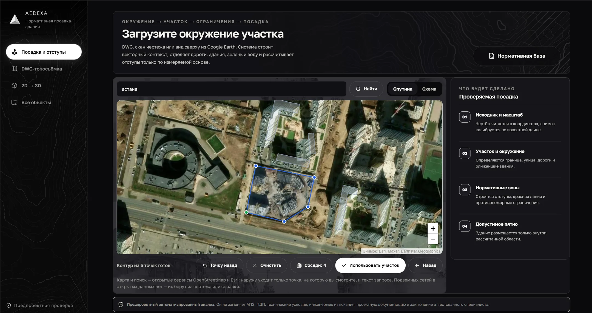
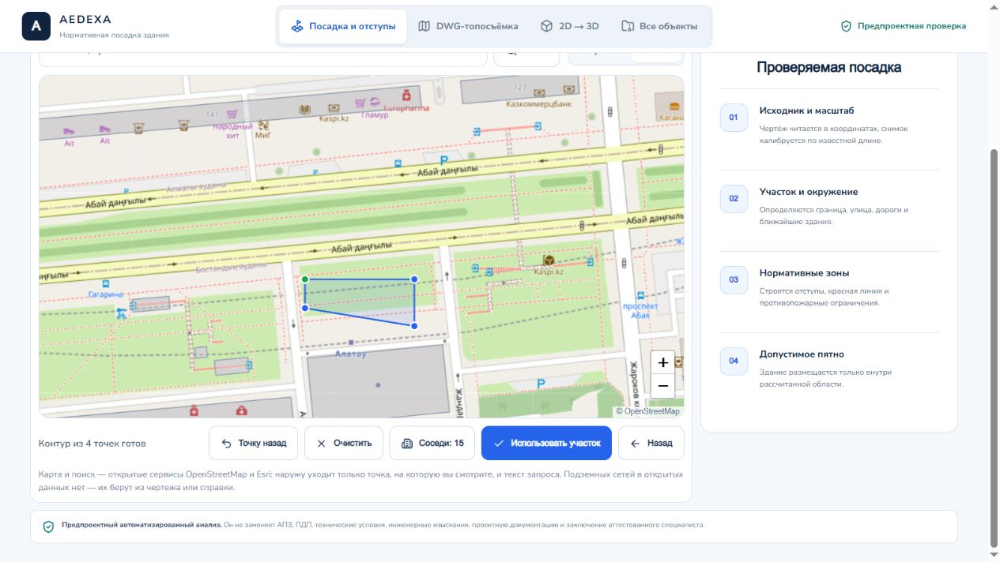
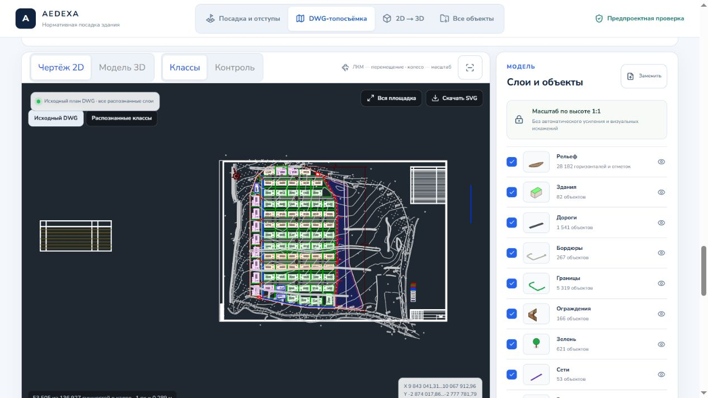
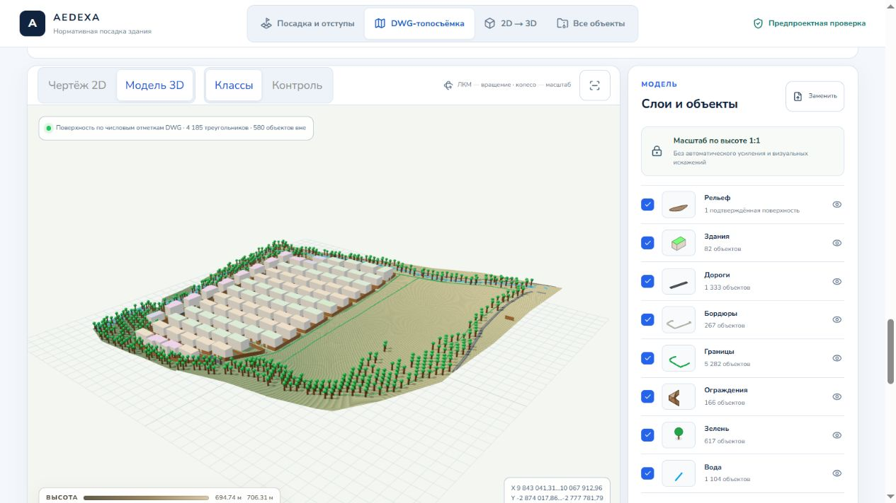
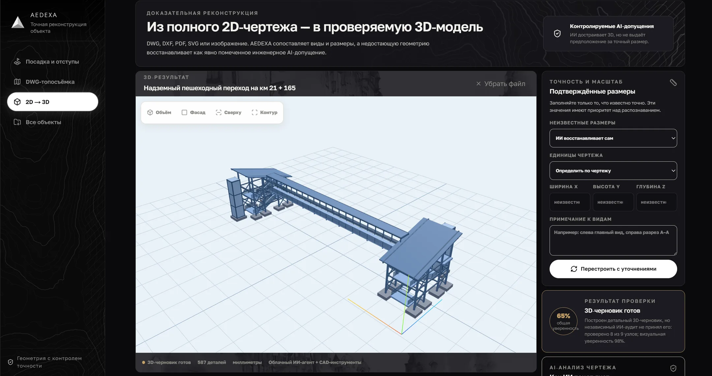
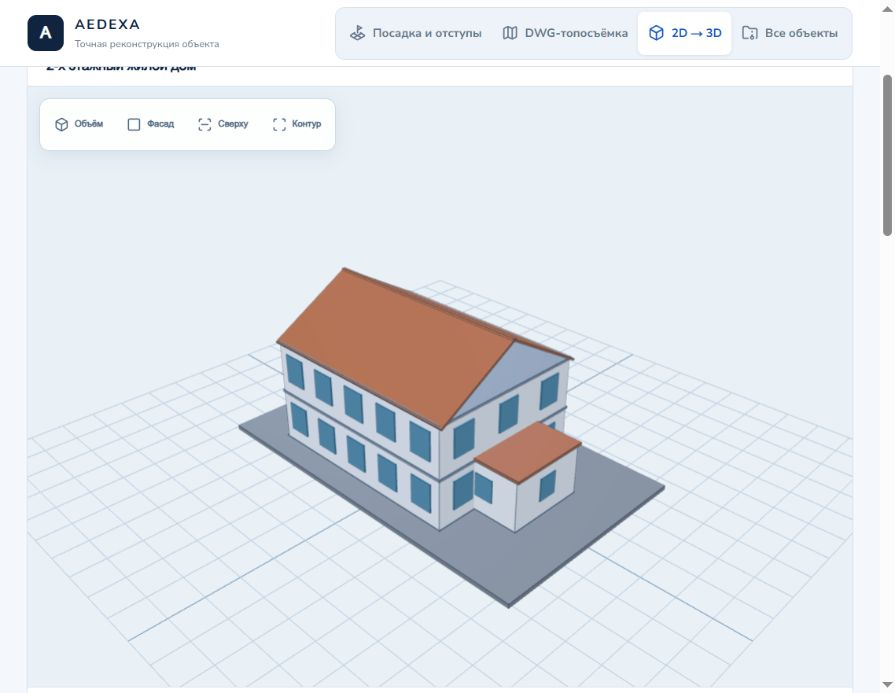
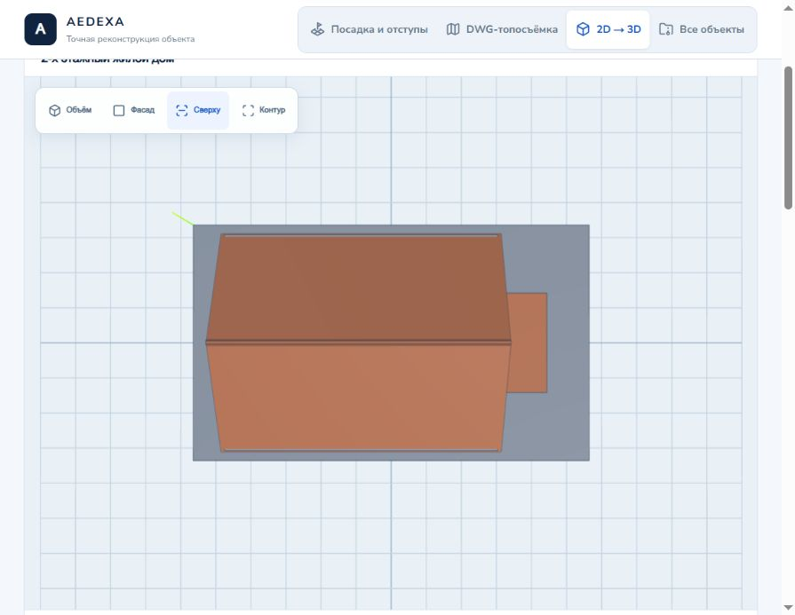
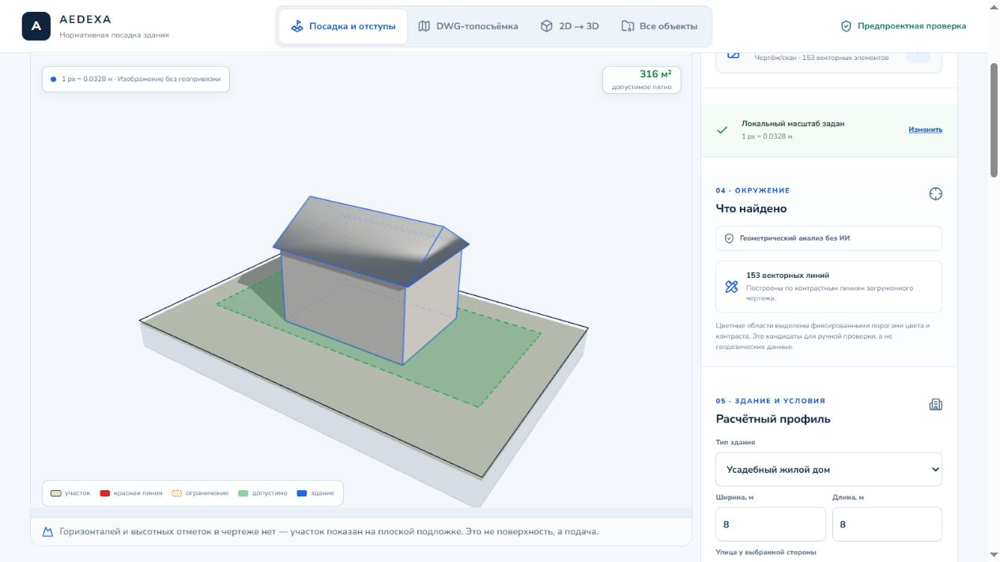

# AEDEXA
### From a drawing and a parcel to an inspectable spatial model.

AEDEXA combines a browser workspace for architectural site planning with a research pipeline for reconstructing geometry from technical drawings. **QwertyS · architectural tooling · hackathon prototype.**

*The browser workspace brings the site, controls and planning context into one view.*

## Two connected problems

An early planning decision needs both a usable building model and an understanding of the site around it. A drawing file does not automatically contain a coherent 3D building: plans and elevations may be unlabelled, dimensions can refer to different objects, and several unrelated views can share the same sheet. A parcel outline also tells only part of the story when the land has elevation changes.

The project therefore has two tracks: **an interactive planning experience**, where geometry and terrain can be explored, and **a deterministic reconstruction investigation**, where a drawing must provide enough evidence to support a model. They share a spatial workflow, but have different maturity levels.

## Explore the site before placing the building

The browser workflow starts with location and the parcel. Map contours establish the area of interest; topographic views show the shape of the terrain. The user can switch between an overhead interpretation and a spatial one rather than trying to infer every slope from a flat map.

*Parcel contour editing in the September functional prototype.*

*A topographic plan exposes the terrain as an overhead working surface.*

*The same terrain can be inspected in 3D; this is an application capture, not a rendered architectural proposal.*

## Bring geometry into the planning workspace

The modelling view allows a building to be inspected from different directions. This matters because a plausible isometric silhouette can still hide an incorrect footprint or height relationship. Overhead and profile views provide a quick cross-check before the model is used for placement.

*The darker presentation build: geometry inspection within the model workspace.*

*A drawing-derived building example in the earlier functional prototype.*

*An overhead inspection of the same building example makes the footprint easier to verify.*

The placement stage joins the building and the parcel. Its purpose is to make scale and spatial relationships visible: the building should be assessed against the working site rather than shown as an isolated object on an infinite grid.

*Building placement against the site and buildable area, with scale controls visible.*

## Reconstruction: evidence before extrusion

The reconstruction pipeline looks for identifiable views, extracts geometric and dimensional evidence, pairs compatible plans and elevations, and checks whether a supported archetype can be built. It handles rectangular and selected polygonal footprints in its controlled cases. Missing captions, inconsistent dimensions or an unsupported form should produce a diagnostic outcome instead of an invented building.

~~~mermaid
flowchart TD
 A[DWG / drawing input] --> B[Conversion and view discovery]
 B --> C[Caption and dimension evidence]
 C --> D[Plan / elevation pairing]
 D --> E{Supported consistent geometry?}
 E -->|Yes| F[Construct and inspect model]
 E -->|No| G[Explain the failed stage]
 F --> H[Browser placement and terrain context]
~~~

### What the real-drawing audit revealed

The internal audit covered **66 industrial DWG files**. It produced one built model; the other files exposed problems at different stages. That result is valuable because it identifies the actual bottleneck: reliable view interpretation is much harder than extruding an already clean footprint.

| Audit outcome | Files |
|---|---:|
| Conversion failure | 2 |
| No usable view, despite captions | 21 |
| No usable view and no captions | 23 |
| Plan/elevation pairing failure | 2 |
| Unsupported or invalid archetype | 17 |
| Model built | 1 |

Controlled polygon examples and a successful browser demonstration do not establish general industrial drawing reconstruction. The audit is kept separate from the product walkthrough for that reason.

## Design and implementation choices

**Browser:** interactive map, terrain and 3D model views, with dedicated controls for parcel work and placement. **Geometry:** conversion, view discovery, dimension interpretation and deterministic construction checks. **Validation:** compare multiple viewpoints and keep stage-specific failure information.

The gallery deliberately includes two documented UI generations: the dark presentation build and the light September functional prototype. They demonstrate different parts of the project; they are not presented as screenshots of one unchanged release. AEDEXA remains a prototype and does not replace a professional architectural or regulatory review.

---

### Built by

**QwertyS** — [Shakhnazar Akhmer](https://github.com/Eye172) and [Nurkhan Aimukatov](https://github.com/pip00sya).

[More projects](https://github.com/Eye172) · [Contact](mailto:shakh090909@gmail.com)

This repository presents the product and its engineering. The implementation is maintained separately. Screenshots and documented experiments are identified in their captions; a live deployment is not required to explore the case study.
