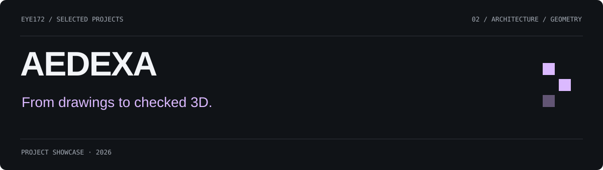
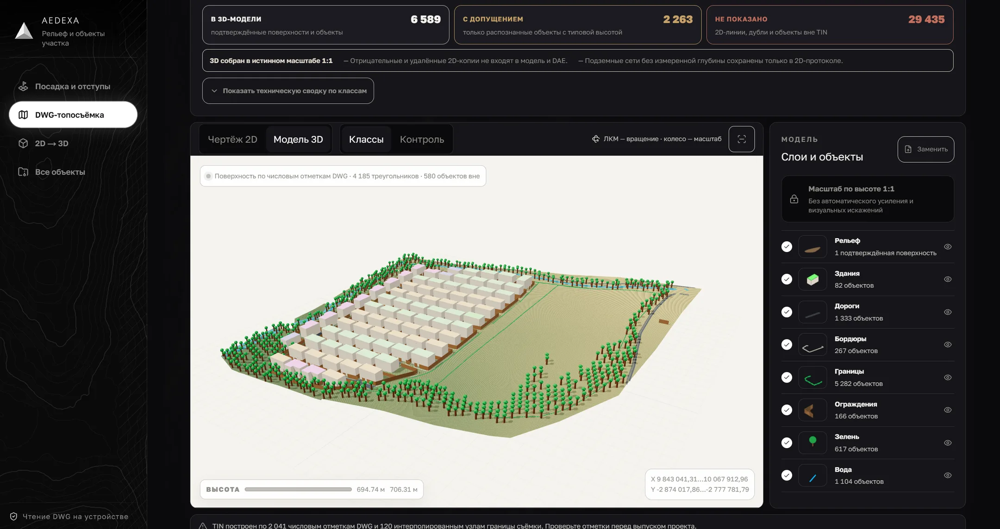
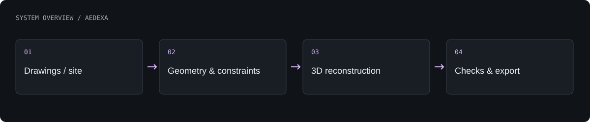

# AEDEXA

A drawing-to-3D reconstruction system and a browser workspace for early-stage architectural site planning.

**Product prototype · under development**

[What is built](#what-is-built) · [Architecture](#architecture) · [Authors](#authors) · [Profile](https://github.com/Eye172)

## Product gallery

Site-planning visual from the project’s own showcase assets.

More screenshots and project visuals

Topographic visual from the project’s own showcase assets.

3D visual from the project’s own showcase assets.

## What is built

- Turn supported DXF drawings into geometric observations, reconciled dimensions and a 3D model.
- Check the reconstructed geometry against the input views and report unresolved parameters.
- Explore site boundaries, buildable areas, utility zones, terrain and building placement.
- Inspect result states and export supported site-planning outputs.

## Architecture

The reconstruction engine separates drawing interpretation, constraint solving, geometry construction and verification. The browser workspace handles site geometry and interactive 2D/3D exploration, with server integrations for selected reconstruction and analysis tasks.

**Technology:** Python · NumPy · SciPy · ezdxf · trimesh · TypeScript · React · Three.js · Cloudflare.

## Current scope

The deterministic reconstruction core has strong synthetic checks but limited coverage of varied industrial drawings. Site-planning outputs are preliminary and require project-specific professional verification.

## Authors

**QwertyS** — [Shakhnazar Akhmer](https://github.com/Eye172) and [Nurkhan Aimukatov](https://github.com/pip00sya).

## About this repository

This is a standalone project showcase containing a product description, visuals and a high-level architecture overview. Implementation source, model weights, credentials and internal project materials are not distributed here. No deployment is required to explore this page.

[Contact](mailto:shakh090909@gmail.com) · [GitHub profile](https://github.com/Eye172)
